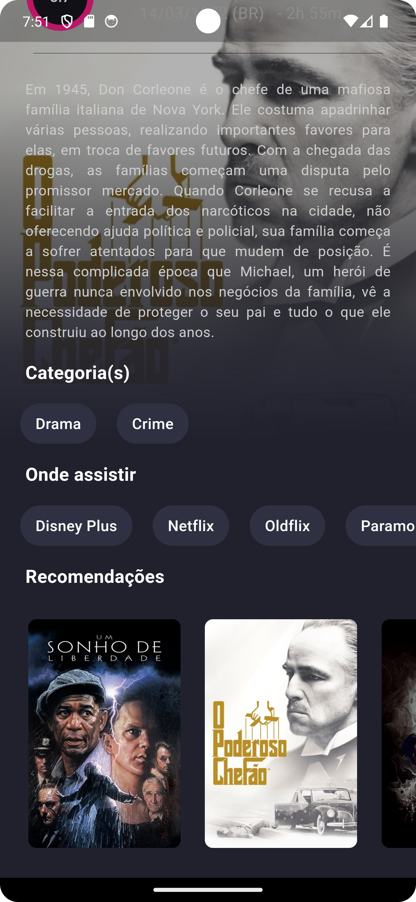

# TMDB Movies App

Este é um aplicativo de filmes desenvolvido com Flutter, utilizando a API do The Movie Database (TMDB) para buscar e exibir informações sobre filmes.


### Capturas de Tela





## Funcionalidades

- Listagem de filmes populares e melhor avaliados
- Detalhes dos filmes
- Pesquisa de filmes
- Adicionar e remover filmes dos favoritos

## Tecnologias Utilizadas

- Flutter
- Flutter BLoC para gerenciamento de estado
- TMDB API
- Local Storage para armazenamento de favoritos

## Como Rodar o Aplicativo

### Pré-requisitos

- Flutter instalado na sua máquina. Você pode seguir as instruções de instalação no [site oficial do Flutter](https://flutter.dev/docs/get-started/install).

### Passos para rodar

1. Clone este repositório:

```bash
git clone https://github.com/seu-usuario/tmdb-movies-app.git
``` 

2. Navegue até o diretório do projeto:

```bash
cd tmdb-movies-app
```

3. Instale as dependências:

```bash
flutter pub get
```

4. Execute o aplicativo:

```bash
flutter run
```


### Referências
 - Documentação da API do TMDB[https://developer.themoviedb.org/docs/getting-started]
 - Design no Figma[https://www.figma.com/design/rgF1Lc0lwEkv2sWKs9mkAL/TMDB-(Community)?node-id=0-1&t=MUC8HwyqCiiSxlY4-0]