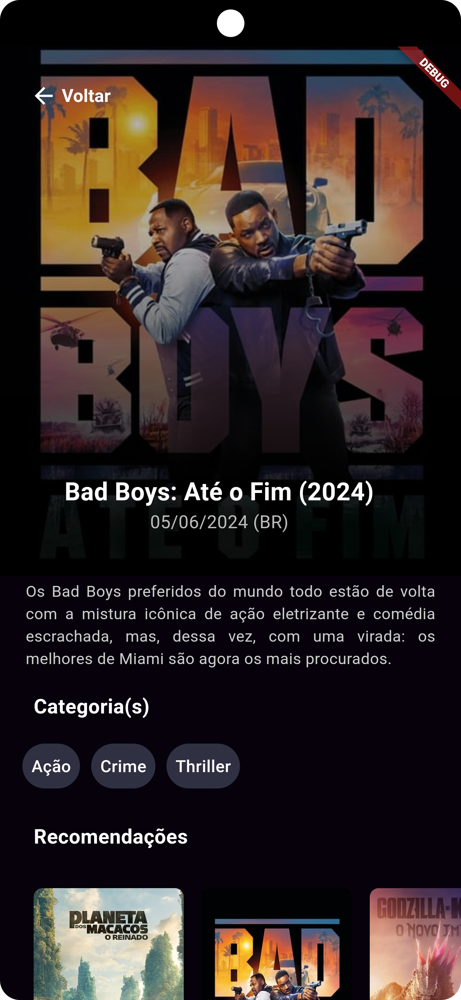

# Aplicativo TMDB Movies

Este é um projeto de aprendizado desenvolvido em Flutter com integração com a API do The Movie Database (TMDB), buscando filmes populares e exibindo-os em uma interface.

## Recursos

- **Obtenção de Dados**: Utiliza a API do TMDB para buscar dados de filmes populares.
- **Detalhes do Filme**: Permite aos usuários visualizar informações detalhadas sobre cada filme.

## Estrutura do Projeto

- `pages/`: Contém as telas do aplicativo, seus respectivos controllers e componentes.
- `models/`: Contém classes de modelo para filmes e detalhes de filmes.
- `data/`: Contém funções para buscar dados da API do TMDB.

## Telas

### Tela de Splash

A tela de splash é a primeira tela exibida quando o aplicativo é aberto. Ela apresenta o logotipo ou a animação da marca do aplicativo enquanto os recursos são carregados em segundo plano. A tela de splash geralmente fornece uma experiência inicial agradável para os usuários.

### Tela Inicial (Home)

Na tela inicial, são exibidas duas listas de filmes populares obtidas da API do The Movie Database (TMDB). As listas são carregadas dinamicamente conforme o usuário rola a tela, proporcionando uma experiência de carregamento suave. Cada filme é exibido em um cartão com uma imagem de capa e o título. Ao tocar em um filme, o usuário é redirecionado para a tela de detalhes do filme.

### Tela de Detalhes do Filme

Na tela de detalhes do filme, são exibidas informações mais detalhadas sobre o filme selecionado. Isso inclui o título, a sinopse, o ano de lançamento, o gênero e outras informações relevantes. 

## Como Usar

Para utilizar este projeto, siga estas etapas:

1. Clone este repositório.
2. Certifique-se de ter o Flutter instalado e configurado.
3. Execute `flutter pub get` para instalar as dependências.
4. Atualize a chave da API do TMDB na função `fetchData` no arquivo `data/data_fetch.dart`.
5. Execute o aplicativo no seu dispositivo ou emulador.

## Aprendizados

Durante o desenvolvimento deste projeto, aprendi:

- Como buscar dados de uma API REST no Flutter usando o pacote `http`.
- Como lidar com dados JSON e convertê-los em objetos Dart.
- Gerenciamento de estado no Flutter usando diferentes métodos: `ChangeNotifier`, `Cubit` e `Bloc`. Dependendo da branch, você verá diferentes implementações. Eu usei para aprender gerenciar estados das diferentes formas.
- Navegação entre telas e passagem de dados no Flutter usando `Navigator`.

## Créditos

Este projeto utiliza a API do TMDB para buscar dados de filmes. Para mais informações, visite [TMDB API](https://www.themoviedb.org/documentation/api).

