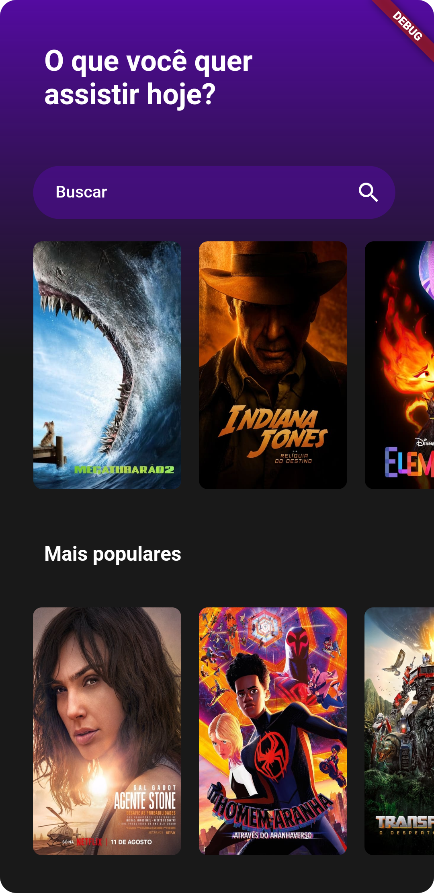
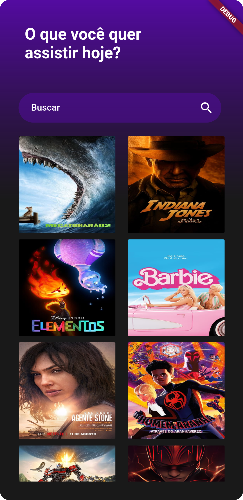
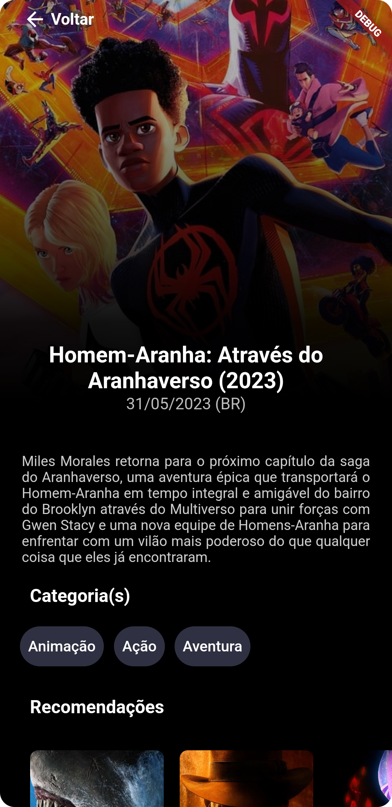

# tmdb_movies
# Título do Projeto

Descrição curta do seu projeto aqui.

## Tabela de Conteúdo

- [Visão Geral](#visão-geral)
- [Funcionalidades](#funcionalidades)
- [Tecnologias Utilizadas](#tecnologias-utilizadas)
- [Capturas de Tela](#capturas-de-tela)
- [Como Usar](#como-usar)
- [Contribuição](#contribuição)

## Visão Geral

O projeto é uma aplicação móvel desenvolvida em Flutter que consome a API do TMDB (The Movie Database) para exibir informações sobre filmes e replica a interface de usuário de um design fornecido no Figma (link para o design: - [Figma Design](https://www.figma.com/community/file/1059842558004825230/TMDB)).
## Funcionalidades

    - Consumo da API do TMDB.
    - Implementação de UI semelhante ao design no Figma.
    - Gerenciamento de estado com diferentes abordagens (ChangeNotifier, Bloc, Cubit).
    - Exibição de listas de filmes com informações.
    - Funcionalidade de pesquisa para encontrar filmes por título.

## Tecnologias Utilizadas

As principais tecnologias e ferramentas utilizadas neste projeto incluem:

- Flutter: Framework de código aberto da Google para o desenvolvimento de aplicativos multiplataforma.
- Dart: Linguagem de programação utilizada no desenvolvimento de aplicativos Flutter.
- TMDB API: A aplicação consome a API do TMDB para obter informações sobre filmes, incluindo detalhes, pôsteres, datas de lançamento e muito mais.
  - State Management:
    - ChangeNotifier: Uma abordagem de gerenciamento de estado baseada no Flutter.
    - Bloc: Utilizado para gerenciamento de estado com a arquitetura de blocos.
    - Cubit: Uma implementação simplificada de Bloc para gerenciamento de estado.

## Capturas de Tela

## Como Usar

- Clonar o repositório.
- Instalar dependências.
- Executar o aplicativo no emulador ou dispositivo.

## Contribuição 
(ou próximos passos)
 - trabalhar na funcionalidade de pesquisa
   - cada letra q for adicionada quero q faca uma pesquisa nova
   - ao deixar o campo de pesquisa em branco tem que voltar a aparecer a home page como no state HomePageSuccessState
 - na versão que tem o grid view criar o list view dos filmes pra colocar na página de informações do filme
 - terminar de replicar UI
 - consumir uma API diferente para o segundo list view

